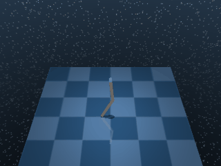

# Acrobot

This family focuses on two-link underactuated pendulum's mounted on a fixed pivot. The agent torques the second joint only, where the first joint swings passively.

All Acrobot variants share the same body, dynamics, and termination rule; they only differ via the reward function.

## AcrobotSwingup

{ align=right width=240 }

| Property | Value |
| --- | --- |
| Canonical ID | `mjx/acrobot_swingup-v0` |
| Action space | `Box(-1.0, 1.0, (1,), float32)` |
| Observation space | `Box(-inf, inf, (6,), float32)` |
| Episode length | 1000 |

### Description

The pendulum starts at rest, hanging straight down. The agent must swing the tip up to a target position. Only the second joint is actuated, so the tip can't be lifted directly — momentum has to build up through the underactuated dynamics.

### Rewards

Uses a dense reward with a smooth `tolerance` indicator over tip-to-target distance:

```python
reward = tolerance(
    distance(tip, target),
    bounds=(0.0, big_target_radius),
    margin=big_target_radius,
)
```

`tolerance` is DM Control's smooth indicator. It returns:

- `1.0` while the input sits inside `bounds`.
- A smooth decay to `value_at_margin` as the input moves out to `margin`.
- `0.0` past that.

### Starting state

```text title=""
obs = [-0.5403  0.2908 -0.8415 -0.9568  0.      0.    ]
```

(orientations of the two links followed by their angular velocities; both joints at rest.)

### Termination

Episode ends when `step >= max_steps` (default 1000). No early termination.

### Usage

```python
import envrax
env = envrax.make("mjx/acrobot_swingup-v0")
```

### Reference

Upstream: [`mujoco_playground/_src/dm_control_suite/acrobot.py`](https://github.com/google-deepmind/mujoco_playground/blob/main/mujoco_playground/_src/dm_control_suite/acrobot.py).

---

## AcrobotSwingupSparse

{ align=right width=240 }

| Property | Value |
| --- | --- |
| Canonical ID | `mjx/acrobot_swingup_sparse-v0` |
| Action space | `Box(-1.0, 1.0, (1,), float32)` |
| Observation space | `Box(-inf, inf, (6,), float32)` |
| Episode length | 1000 |

### Description

The pendulum starts at rest, hanging straight down. The agent must swing the tip up to a target position via the underactuated dynamics — same body, dynamics, and starting state as `AcrobotSwingup`, but with a tighter target tolerance.

### Rewards

Uses a sparse reward with a `tolerance` indicator over tip-to-target distance:

```python
reward = tolerance(
    distance(tip, target),
    bounds=(0.0, small_target_radius),
    margin=0.0,
)
```

With `margin=0.0` the smooth decay collapses to a step. The indicator becomes binary:

- `1.0` when the tip is within `small_target_radius` of the target.
- `0.0` otherwise.

### Starting state

```text title=""
obs = [-0.5403  0.2908 -0.8415 -0.9568  0.      0.    ]
```

### Termination

Episode ends when `step >= max_steps` (default 1000). No early termination.

### Usage

```python
import envrax
env = envrax.make("mjx/acrobot_swingup_sparse-v0")
```

### Reference

Upstream: [`mujoco_playground/_src/dm_control_suite/acrobot.py`](https://github.com/google-deepmind/mujoco_playground/blob/main/mujoco_playground/_src/dm_control_suite/acrobot.py).
