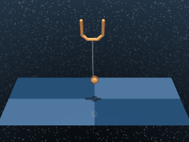

# Ball in Cup

A planar ball-and-cup task: a ball hangs from a tether attached to a movable cup. The agent actuates the cup in 2D and must catch the ball inside.

## BallInCup

{ align=right width=240 }

| Property | Value |
| --- | --- |
| Canonical ID | `mjx/ball_in_cup-v0` |
| Action space | `Box(-1.0, 1.0, (2,), float32)` |
| Observation space | `Box(-inf, inf, (8,), float32)` |
| Episode length | 1000 |

### Description

The cup moves freely in the 2D plane while the ball swings on its tether. The task succeeds the moment the ball is brought inside the cup's catch region. The tether dynamics make this a coordination problem — yanking the cup directly toward the ball usually misses on the first pass and overshoots on the second.

### Rewards

Uses a sparse reward that fires only when the ball sits inside the cup's catch region in both x and z:

```python
ball_to_target = abs(target_xz - ball_xz)
inside = (ball_to_target < target_size - ball_size).astype(float)
reward = inside.prod()  # AND across x and z
```

The product over the two axes acts as a logical AND. The reward is binary:

- `1.0` when the ball is inside the catch region in both x __and__ z.
- `0.0` if either axis is outside.

### Starting state

```text title=""
obs = [0. 0. 0. 0. 0. 0. 0. 0.]
```

(`qpos` and `qvel` concatenated — cup at the origin, ball hanging at rest.)

### Termination

Episode ends when `step >= max_steps` (default 1000). No early termination.

### Usage

```python
import envrax
env = envrax.make("mjx/ball_in_cup-v0")
```

### Reference

Upstream: [`mujoco_playground/_src/dm_control_suite/ball_in_cup.py`](https://github.com/google-deepmind/mujoco_playground/blob/main/mujoco_playground/_src/dm_control_suite/ball_in_cup.py).
