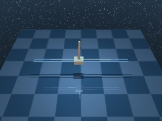
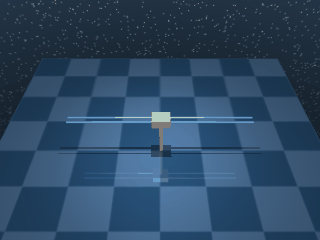

# Cartpole

A cart on a frictionless track with a free-rotating pole attached. Four task variants share the same body and dynamics, differing only in starting state (upright vs hanging) and reward style (dense vs sparse).

## CartpoleBalance

{ align=right width=240 }

| Property | Value |
| --- | --- |
| Canonical ID | `mjx/cartpole_balance-v0` |
| Action space | `Box(-1.0, 1.0, (1,), float32)` |
| Observation space | `Box(-inf, inf, (5,), float32)` |
| Episode length | 1000 |
| Config | `{"ctrl_dt": 0.01, "sim_dt": 0.01, "naconmax": 0, "njmax": 2}` |

### Description

The cart starts near upright with a small angular perturbation. The agent applies horizontal force to the cart to keep the pole vertical and the cart centred on the track.

### Rewards

Uses a dense reward built as the product of four normalised components, each on `[0, 1]`:

```python
upright        = (pole_angle_cos + 1) / 2
centered       = (1 + tolerance(cart_position, margin=2)) / 2
small_control  = (4 + tolerance(action, margin=1, sigmoid="quadratic")) / 5
small_velocity = (1 + tolerance(angular_vel, margin=5).min()) / 2
reward = upright * centered * small_control * small_velocity
```

Multiplying four components means each one is a soft veto — if any one collapses to zero, the whole reward goes with it:

- `upright` — half the cosine of the pole angle, shifted to `[0, 1]`. `1.0` when vertical, `0.0` when hanging.
- `centered` — `tolerance` on cart position rescaled into `[0.5, 1.0]`, so it lightly modulates rather than dominates.
- `small_control` — quadratic action penalty rescaled into `[0.8, 1.0]`.
- `small_velocity` — `tolerance` on pole angular velocity rescaled into `[0.5, 1.0]`, so jittery balance is gently penalised.

### Starting state

```text title=""
obs = [ 0.0158  0.9996 -0.0278 -0.0134 -0.0035]
```

(cart position, `cos(pole_angle)`, `sin(pole_angle)`, cart velocity, pole angular velocity — pole near upright with `cos ≈ 1`.)

### Termination

Episode ends when `step >= max_steps` (default 1000). No early termination on falling.

### Usage

```python
import envrax
env = envrax.make("mjx/cartpole_balance-v0")
```

### Reference

Upstream: [`mujoco_playground/_src/dm_control_suite/cartpole.py`](https://github.com/google-deepmind/mujoco_playground/blob/main/mujoco_playground/_src/dm_control_suite/cartpole.py).

---

## CartpoleBalanceSparse

{ align=right width=240 }

| Property | Value |
| --- | --- |
| Canonical ID | `mjx/cartpole_balance_sparse-v0` |
| Action space | `Box(-1.0, 1.0, (1,), float32)` |
| Observation space | `Box(-inf, inf, (5,), float32)` |
| Episode length | 1000 |
| Config | `{"ctrl_dt": 0.01, "sim_dt": 0.01, "naconmax": 0, "njmax": 2}` |

### Description

Same physics and starting state as `CartpoleBalance` — the cart begins near upright and the agent must keep the pole vertical and the cart centred. This variant uses tighter tolerance bands on cart position and pole angle, so the success criterion is harder to satisfy than in the dense variant.

### Rewards

Uses a sparse reward that fires only when both the cart's position and the pole's angle sit inside their tolerance bands:

```python
cart_in_bounds  = tolerance(cart_position, CART_RANGE)
angle_in_bounds = tolerance(pole_angle_cos, ANGLE_COS_RANGE).prod()
reward = cart_in_bounds * angle_in_bounds
```

With the default zero `margin`, both `tolerance` calls collapse to step indicators. The product acts as a logical AND:

- `1.0` when the cart sits inside `CART_RANGE` __and__ the pole is inside `ANGLE_COS_RANGE`.
- `0.0` if either is outside.

### Starting state

```text title=""
obs = [ 0.0158  0.9996 -0.0278 -0.0134 -0.0035]
```

### Termination

Episode ends when `step >= max_steps` (default 1000). No early termination on falling.

### Usage

```python
import envrax
env = envrax.make("mjx/cartpole_balance_sparse-v0")
```

### Reference

Upstream: [`mujoco_playground/_src/dm_control_suite/cartpole.py`](https://github.com/google-deepmind/mujoco_playground/blob/main/mujoco_playground/_src/dm_control_suite/cartpole.py).

---

## CartpoleSwingup

{ align=right width=240 }

| Property | Value |
| --- | --- |
| Canonical ID | `mjx/cartpole_swingup-v0` |
| Action space | `Box(-1.0, 1.0, (1,), float32)` |
| Observation space | `Box(-inf, inf, (5,), float32)` |
| Episode length | 1000 |
| Config | `{"ctrl_dt": 0.01, "sim_dt": 0.01, "naconmax": 0, "njmax": 2}` |

### Description

The pole starts hanging straight down. The agent has to swing it up through the underactuated dynamics — available cart force is too small to lift the pole in one push, so energy must build up over multiple swings before the pole crosses the top. Once balanced, the same upright-and-centred objective as `CartpoleBalance` applies.

### Rewards

Uses the same four-component dense reward as `CartpoleBalance`:

```python
upright        = (pole_angle_cos + 1) / 2
centered       = (1 + tolerance(cart_position, margin=2)) / 2
small_control  = (4 + tolerance(action, margin=1, sigmoid="quadratic")) / 5
small_velocity = (1 + tolerance(angular_vel, margin=5).min()) / 2
reward = upright * centered * small_control * small_velocity
```

Same product-as-veto structure as `CartpoleBalance`, just starting from a different pole angle:

- `upright` — half the cosine of the pole angle, shifted to `[0, 1]`. `0.0` when hanging straight down (the starting posture), `1.0` when fully upright.
- `centered` — `tolerance` on cart position rescaled into `[0.5, 1.0]`, lightly modulating rather than dominating.
- `small_control` — quadratic action penalty rescaled into `[0.8, 1.0]`.
- `small_velocity` — `tolerance` on pole angular velocity rescaled into `[0.5, 1.0]`, gently penalising jittery balance.

### Starting state

```text title=""
obs = [-0.0134 -1.     -0.0068 -0.0134 -0.0035]
```

(cart position, `cos(pole_angle)`, `sin(pole_angle)`, cart velocity, pole angular velocity — `cos(pole_angle) = -1` indicates the pole is hanging straight down.)

### Termination

Episode ends when `step >= max_steps` (default 1000). No early termination.

### Usage

```python
import envrax
env = envrax.make("mjx/cartpole_swingup-v0")
```

### Reference

Upstream: [`mujoco_playground/_src/dm_control_suite/cartpole.py`](https://github.com/google-deepmind/mujoco_playground/blob/main/mujoco_playground/_src/dm_control_suite/cartpole.py).

---

## CartpoleSwingupSparse

{ align=right width=240 }

| Property | Value |
| --- | --- |
| Canonical ID | `mjx/cartpole_swingup_sparse-v0` |
| Action space | `Box(-1.0, 1.0, (1,), float32)` |
| Observation space | `Box(-inf, inf, (5,), float32)` |
| Episode length | 1000 |
| Config | `{"ctrl_dt": 0.01, "sim_dt": 0.01, "naconmax": 0, "njmax": 2}` |

### Description

The hardest cartpole variant. The pole starts hanging down (as in `CartpoleSwingup`) and the agent must swing it up through the underactuated dynamics. This variant uses tighter tolerance bands on cart position and pole angle, so success requires both reaching upright __and__ holding inside narrow bounds — random exploration almost never stumbles into the band from the bottom of the swing.

### Rewards

Uses the same two-indicator sparse reward as `CartpoleBalanceSparse`:

```python
cart_in_bounds  = tolerance(cart_position, CART_RANGE)
angle_in_bounds = tolerance(pole_angle_cos, ANGLE_COS_RANGE).prod()
reward = cart_in_bounds * angle_in_bounds
```

With the default zero `margin`, both `tolerance` calls collapse to step indicators. The product acts as a logical AND:

- `1.0` when the cart sits inside `CART_RANGE` __and__ the pole is inside `ANGLE_COS_RANGE`.
- `0.0` if either is outside.

### Starting state

```text title=""
obs = [-0.0134 -1.     -0.0068 -0.0134 -0.0035]
```

### Termination

Episode ends when `step >= max_steps` (default 1000). No early termination.

### Usage

```python
import envrax
env = envrax.make("mjx/cartpole_swingup_sparse-v0")
```

### Reference

Upstream: [`mujoco_playground/_src/dm_control_suite/cartpole.py`](https://github.com/google-deepmind/mujoco_playground/blob/main/mujoco_playground/_src/dm_control_suite/cartpole.py).
