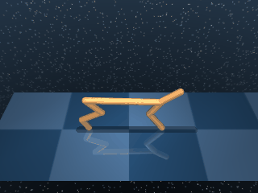

# Cheetah

A planar bipedal cheetah-style runner. The agent torques 6 actuators across the body to maintain forward locomotion across flat ground.

## CheetahRun

{ align=right width=240 }

| Property | Value |
| --- | --- |
| Canonical ID | `mjx/cheetah_run-v0` |
| Action space | `Box(-1.0, 1.0, (6,), float32)` |
| Observation space | `Box(-inf, inf, (17,), float32)` |
| Episode length | 1000 |
| Config | `{"ctrl_dt": 0.01, "sim_dt": 0.01, "naconmax": 100_000, "njmax": 100}` |

### Description

The half-cheetah body runs rightward across flat ground. Six actuators across the torso and legs drive the gait. The body is planar, so the cheetah can't tip sideways, but it can collapse forward or backward — which is the main failure mode for naive policies that throw all their weight into raw acceleration.

### Rewards

Uses a dense reward with a `tolerance` indicator over forward speed:

```python
speed = torso_subtreelinvel[0]  # forward velocity
reward = tolerance(
    speed,
    bounds=(RUN_SPEED, inf),
    margin=RUN_SPEED,
    value_at_margin=0,
    sigmoid="linear",
)
```

`tolerance` is DM Control's smooth indicator. Here it's used with a `linear` sigmoid, so the reward returns:

- `1.0` once `speed >= RUN_SPEED`.
- A linear ramp from `0.0` (at speed `0`) to `1.0` (at `RUN_SPEED`).
- `0.0` if speed dips negative (running backwards).

### Starting state

```text title=""
obs = [-0.1     0.0349 -0.0361  0.0071 -0.0729  0.0074 -0.0493 -0.0379
       -0.0113 -0.0086  0.0134 -0.0104  0.0007 -0.0228 -0.0005 -0.0484 -0.0615]
```

(joint positions followed by joint velocities — body at rest with a small randomisation.)

### Termination

Episode ends when `step >= max_steps` (default 1000). No early termination on falling.

### Usage

```python
import envrax
env = envrax.make("mjx/cheetah_run-v0")
```

### Reference

Upstream: [`mujoco_playground/_src/dm_control_suite/cheetah.py`](https://github.com/google-deepmind/mujoco_playground/blob/main/mujoco_playground/_src/dm_control_suite/cheetah.py).
