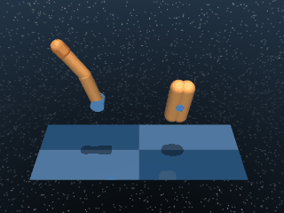
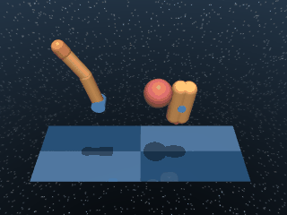
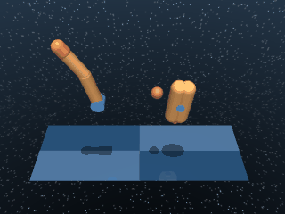

# Finger

A two-DoF planar finger interacting with a free-rotating spinner body. The family covers two task styles: continuously spinning the body, and rotating it to a target angle.

## FingerSpin

{ align=right width=240 }

| Property | Value |
| --- | --- |
| Canonical ID | `mjx/finger_spin-v0` |
| Action space | `Box(-1.0, 1.0, (2,), float32)` |
| Observation space | `Box(-inf, inf, (9,), float32)` |
| Episode length | 1000 |
| Config | `{"ctrl_dt": 0.02, "sim_dt": 0.005, "naconmax": 25_000, "njmax": 50}` |

### Description

The finger has to keep the spinner rotating around its hinge. There's no target angle — only the spinner's instantaneous angular velocity matters. The challenge is producing a coordinated finger motion that builds and sustains spinner momentum without snagging.

### Rewards

Uses a sparse reward that fires only when the spinner is rotating fast enough in the negative direction:

```python
reward = (hinge_velocity <= -SPIN_VELOCITY).astype(float)
```

The threshold gives a clean binary signal:

- `1.0` when the spinner is rotating at or faster than `SPIN_VELOCITY` in the negative direction.
- `0.0` otherwise.

### Starting state

```text title=""
obs = [-1.5711 -0.5291  0.0702 -0.1094  0.      0.      0.      0.      0.    ]
```

(finger joint positions, spinner orientation, and joint velocities — finger initialised at a default configuration with the spinner at rest.)

### Termination

Episode ends when `step >= max_steps` (default 1000). No early termination.

### Usage

```python
import envrax
env = envrax.make("mjx/finger_spin-v0")
```

### Reference

Upstream: [`mujoco_playground/_src/dm_control_suite/finger.py`](https://github.com/google-deepmind/mujoco_playground/blob/main/mujoco_playground/_src/dm_control_suite/finger.py).

---

## FingerTurnEasy

{ align=right width=240 }

| Property | Value |
| --- | --- |
| Canonical ID | `mjx/finger_turn_easy-v0` |
| Action space | `Box(-1.0, 1.0, (2,), float32)` |
| Observation space | `Box(-inf, inf, (12,), float32)` |
| Episode length | 1000 |
| Config | `{"ctrl_dt": 0.02, "sim_dt": 0.005, "naconmax": 25_000, "njmax": 50}` |

### Description

The finger has to rotate the spinner to a randomised target angle and hold it there. The "easy" variant uses a generous `EASY_TARGET_SIZE` tolerance around the target, so the agent has a wide acceptance band to find — useful for bootstrapping a controller before tightening the criterion in `FingerTurnHard`.

### Rewards

Uses a sparse reward that fires once the spinner has rotated to within tolerance of the target angle:

```python
reward = (dist_to_target <= 0.0).astype(float)
# dist_to_target uses the EASY_TARGET_SIZE radius
```

`dist_to_target` is signed — negative inside the band, positive outside — so the comparison gives a clean binary signal:

- `1.0` when the spinner sits within `EASY_TARGET_SIZE` of the target angle.
- `0.0` otherwise.

### Starting state

```text title=""
obs = [-1.5711 -0.5291  0.0702 -0.1094  0.      0.      0.      0.      0.
       -0.2     0.      0.2215]
```

(finger and spinner state plus the target's position fields appended at the end.)

### Termination

Episode ends when `step >= max_steps` (default 1000). No early termination.

### Usage

```python
import envrax
env = envrax.make("mjx/finger_turn_easy-v0")
```

### Reference

Upstream: [`mujoco_playground/_src/dm_control_suite/finger.py`](https://github.com/google-deepmind/mujoco_playground/blob/main/mujoco_playground/_src/dm_control_suite/finger.py).

---

## FingerTurnHard

{ align=right width=240 }

| Property | Value |
| --- | --- |
| Canonical ID | `mjx/finger_turn_hard-v0` |
| Action space | `Box(-1.0, 1.0, (2,), float32)` |
| Observation space | `Box(-inf, inf, (12,), float32)` |
| Episode length | 1000 |
| Config | `{"ctrl_dt": 0.02, "sim_dt": 0.005, "naconmax": 25_000, "njmax": 50}` |

### Description

The same target-rotation task as `FingerTurnEasy`, but the tolerance shrinks to `HARD_TARGET_SIZE`. With the smaller acceptance band, random exploration almost never lands inside the target — the variant doubles as a sparse-exploration benchmark on top of the manipulation task itself.

### Rewards

Uses a sparse reward that fires once the spinner has rotated to within the tighter tolerance band:

```python
reward = (dist_to_target <= 0.0).astype(float)
# dist_to_target uses the HARD_TARGET_SIZE radius
```

`dist_to_target` is signed — negative inside the band, positive outside — so the comparison gives a clean binary signal:

- `1.0` when the spinner sits within `HARD_TARGET_SIZE` of the target angle.
- `0.0` otherwise.

### Starting state

```text title=""
obs = [-1.5711 -0.5291  0.0702 -0.1094  0.      0.      0.      0.      0.
       -0.2     0.      0.2615]
```

### Termination

Episode ends when `step >= max_steps` (default 1000). No early termination.

### Usage

```python
import envrax
env = envrax.make("mjx/finger_turn_hard-v0")
```

### Reference

Upstream: [`mujoco_playground/_src/dm_control_suite/finger.py`](https://github.com/google-deepmind/mujoco_playground/blob/main/mujoco_playground/_src/dm_control_suite/finger.py).
