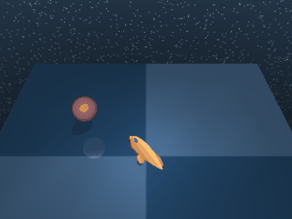

# Fish

A 3D free-swimming fish with five actuated joints in a water-like medium.

## FishSwim

{ align=right width=240 }

| Property | Value |
| --- | --- |
| Canonical ID | `mjx/fish_swim-v0` |
| Action space | `Box(-1.0, 1.0, (5,), float32)` |
| Observation space | `Box(-inf, inf, (24,), float32)` |
| Episode length | 1000 |

### Description

The fish swims toward a randomised target in 3D space. Five actuators across its body produce undulatory locomotion through fluid drag — a noticeably different control regime from the rigid-body locomotion envs in the suite. Lateral roll makes target-tracking harder, so a stable upright posture matters as much as raw forward thrust.

### Rewards

Uses a dense reward that combines an "in target" tolerance with torso uprightness as a weighted sum, with most of the weight on the target term:

```python
in_target  = tolerance(
    norm(mouth_to_target_local),
    bounds=(0, target_radius),
    margin=2 * target_radius,
)
is_upright = 0.5 * (torso_z_up + 1)
reward = (7 * in_target + is_upright) / 8
```

The two terms capture different concerns:

- `in_target` — the smooth `tolerance` indicator over mouth-to-target distance: `1.0` inside `target_radius`, decaying smoothly out to `2 * target_radius`, zero further.
- `is_upright` — the dot product of the torso's up-axis with world-z, normalised to `[0, 1]`. `1.0` when upright, `0.5` on its side, `0.0` upside-down.

### Starting state

```text title=""
obs = [ 0.8535  0.1007  0.1161 -0.129  -0.121  -0.1377  0.1608  0.023
        0.3777  0.1225  0.0365  0.      0.      0.      0.      0.
        0.      0.      0.      0.      0.      0.      0.      0.    ]
```

(joint positions and orientations followed by velocities — fish initialised at the origin with the target randomised, body at rest.)

### Termination

Episode ends when `step >= max_steps` (default 1000). No early termination.

### Usage

```python
import envrax
env = envrax.make("mjx/fish_swim-v0")
```

### Reference

Upstream: [`mujoco_playground/_src/dm_control_suite/fish.py`](https://github.com/google-deepmind/mujoco_playground/blob/main/mujoco_playground/_src/dm_control_suite/fish.py).
