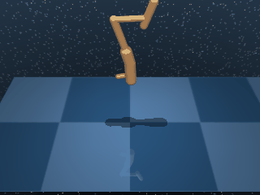

# Hopper

A planar one-legged hopper. Four actuators across the leg drive locomotion or stationary balance depending on the variant. The body and dynamics are shared across both Hop and Stand; only the reward function changes.

## HopperHop

{ align=right width=240 }

| Property | Value |
| --- | --- |
| Canonical ID | `mjx/hopper_hop-v0` |
| Action space | `Box(-1.0, 1.0, (4,), float32)` |
| Observation space | `Box(-inf, inf, (15,), float32)` |
| Episode length | 1000 |

### Description

The hopper must produce sustained forward locomotion across flat ground while keeping its torso above a minimum standing height. A collapsed slide is fast but disqualifies the policy on the height constraint; a tall but stationary stance fails the locomotion constraint. Hopping is the only gait that satisfies both simultaneously, which is the whole challenge.

### Rewards

Uses a dense reward that multiplies a standing-height tolerance with a forward-speed tolerance:

```python
standing = tolerance(torso_height, (STAND_HEIGHT, 2))
hopping  = tolerance(
    forward_speed,
    bounds=(HOP_SPEED, inf),
    margin=HOP_SPEED / 2,
    value_at_margin=0.5,
    sigmoid="linear",
)
reward = standing * hopping
```

The two terms are multiplied so neither alone is enough:

- `standing` — `1.0` while torso height sits in `(STAND_HEIGHT, 2)`, decaying smoothly outside that band.
- `hopping` — linear ramp from `0.5` (at half target speed) to `1.0` (at `HOP_SPEED` or above). Soft floor at `0.5` so the gradient survives even slow hopping.

### Starting state

```text title=""
obs = [ 0.     -2.5709  0.2635 -0.4848  0.5367 -0.475   0.      0.
        0.      0.      0.      0.      0.      0.      0.    ]
```

(joint positions followed by joint velocities — leg initialised in a default rest configuration.)

### Termination

Episode ends when `step >= max_steps` (default 1000). No early termination on falling.

### Usage

```python
import envrax
env = envrax.make("mjx/hopper_hop-v0")
```

### Reference

Upstream: [`mujoco_playground/_src/dm_control_suite/hopper.py`](https://github.com/google-deepmind/mujoco_playground/blob/main/mujoco_playground/_src/dm_control_suite/hopper.py).

---

## HopperStand

{ align=right width=240 }

| Property | Value |
| --- | --- |
| Canonical ID | `mjx/hopper_stand-v0` |
| Action space | `Box(-1.0, 1.0, (4,), float32)` |
| Observation space | `Box(-inf, inf, (15,), float32)` |
| Episode length | 1000 |

### Description

The same one-legged hopper, but now stationary. The agent must balance the body upright above a minimum standing height with as little control effort as possible. Steady balance is preferred over jittery "standing" — a calm posture that holds the leg roughly still scores better than one that twitches constantly to stay upright.

### Rewards

Uses a dense reward that multiplies a standing-height tolerance with a small-control penalty:

```python
standing      = tolerance(torso_height, (STAND_HEIGHT, 2))
small_control = (4 + tolerance(action, margin=1, sigmoid="quadratic").mean()) / 5
reward = standing * small_control
```

The two terms encode separate soft constraints:

- `standing` — `1.0` while torso height sits in `(STAND_HEIGHT, 2)`, decaying smoothly outside that band.
- `small_control` — quadratic action penalty rescaled into `[0.8, 1.0]`, so it lightly modulates the primary `standing` term rather than dominating it.

### Starting state

```text title=""
obs = [ 0.     -2.5709  0.2635 -0.4848  0.5367 -0.475   0.      0.
        0.      0.      0.      0.      0.      0.      0.    ]
```

### Termination

Episode ends when `step >= max_steps` (default 1000). No early termination on falling.

### Usage

```python
import envrax
env = envrax.make("mjx/hopper_stand-v0")
```

### Reference

Upstream: [`mujoco_playground/_src/dm_control_suite/hopper.py`](https://github.com/google-deepmind/mujoco_playground/blob/main/mujoco_playground/_src/dm_control_suite/hopper.py).
