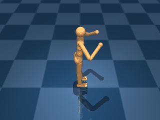

# Humanoid

A 3D 21-DoF humanoid with full upper- and lower-body actuation. Three variants share the body and dynamics; they differ only in the target locomotion speed baked into the reward — a stationary stand, a walking gait, and a running gait.

## HumanoidStand

{ align=right width=240 }

| Property | Value |
| --- | --- |
| Canonical ID | `mjx/humanoid_stand-v0` |
| Action space | `Box(-1.0, 1.0, (21,), float32)` |
| Observation space | `Box(-inf, inf, (67,), float32)` |
| Episode length | 1000 |
| Config | `{"ctrl_dt": 0.025, "sim_dt": 0.005, "naconmax": 200_000, "njmax": 250}` |

### Description

The humanoid has to stand upright and stationary, keeping its head above a minimum standing height. With 21 actuators and full body articulation, the challenge isn't holding a pose — it's coordinating the full kinematic chain to stay balanced while keeping horizontal velocity at zero.

### Rewards

Uses a dense reward that multiplies three terms — a stand reward, a "don't move" reward, and a small-control penalty:

```python
standing       = tolerance(head_height, bounds=(STAND_HEIGHT, inf), margin=STAND_HEIGHT / 4)
upright        = tolerance(torso_upright, bounds=(0.9, inf), margin=1.9, sigmoid="linear", value_at_margin=0)
stand_reward   = standing * upright
dont_move      = tolerance(horizontal_velocity, margin=2).mean()
small_control  = (4 + tolerance(action, margin=1, sigmoid="quadratic").mean()) / 5
reward = stand_reward * dont_move * small_control
```

Each component captures a separate concern:

- `standing` — `tolerance` on head height: `1.0` once the head clears `STAND_HEIGHT`, decaying smoothly as it sinks.
- `upright` — `tolerance` on torso vertical alignment: `1.0` once `torso_upright >= 0.9`, ramping linearly to `0.0` as the torso tilts toward horizontal.
- `dont_move` — penalises horizontal centre-of-mass velocity; `1.0` near zero, decays away from rest.
- `small_control` — quadratic action penalty rescaled into `[0.8, 1.0]`, so it lightly modulates the primary terms rather than dominating.

### Starting state

```text title=""
obs = [ 0.      0.      0.      0.      0.      0.      0.      0.
        0.      0.      0.      0.      0.      0.      0.      0.
        0.      0.      0.      0.      0.      1.69    0.36    0.17
        0.06   -0.0027  0.09   -1.258   0.36   -0.17    0.06   -0.0027
       -0.09   -1.258   0.      0.      1.      0.      0.      0.
        0.      0.      0.      0.      0.      0.      0.      0.
        0.      0.      0.      0.      0.      0.      0.      0.
        0.      0.      0.      0.      0.      0.      0.      0.
        0.      0.      0.    ]
```

(67-dim observation: joint positions, joint velocities, end-effector positions, sensor readings — humanoid initialised in a default standing posture.)

### Termination

Episode ends when `step >= max_steps` (default 1000). No early termination on falling.

### Usage

```python
import envrax
env = envrax.make("mjx/humanoid_stand-v0")
```

### Reference

Upstream: [`mujoco_playground/_src/dm_control_suite/humanoid.py`](https://github.com/google-deepmind/mujoco_playground/blob/main/mujoco_playground/_src/dm_control_suite/humanoid.py).

---

## HumanoidWalk

{ align=right width=240 }

| Property | Value |
| --- | --- |
| Canonical ID | `mjx/humanoid_walk-v0` |
| Action space | `Box(-1.0, 1.0, (21,), float32)` |
| Observation space | `Box(-inf, inf, (67,), float32)` |
| Episode length | 1000 |
| Config | `{"ctrl_dt": 0.025, "sim_dt": 0.005, "naconmax": 200_000, "njmax": 250}` |

### Description

The same body and dynamics as `HumanoidStand`, now walking forward at a target horizontal speed. Standing stably is no longer enough — the agent has to coordinate the full kinematic chain into a forward gait while still keeping the head above the standing height and the torso roughly vertical.

### Rewards

Uses the same dense reward shape as `HumanoidStand`, with the `dont_move` term replaced by a `move_reward`:

```python
standing       = tolerance(head_height, bounds=(STAND_HEIGHT, inf), margin=STAND_HEIGHT / 4)
upright        = tolerance(torso_upright, bounds=(0.9, inf), margin=1.9, sigmoid="linear", value_at_margin=0)
stand_reward   = standing * upright
move           = tolerance(
    norm(horizontal_velocity),
    bounds=(WALK_SPEED, inf),
    margin=WALK_SPEED,
    value_at_margin=0,
    sigmoid="linear",
)
move_reward    = (5 * move + 1) / 6
small_control  = (4 + tolerance(action, margin=1, sigmoid="quadratic").mean()) / 5
reward = stand_reward * move_reward * small_control
```

Each component captures a separate concern:

- `standing` — `tolerance` on head height: `1.0` once the head clears `STAND_HEIGHT`, decaying smoothly as it sinks.
- `upright` — `tolerance` on torso vertical alignment: `1.0` once `torso_upright >= 0.9`, ramping linearly down as the torso tilts.
- `move_reward` — linear ramp from `0.0` (at zero speed) to `1.0` (at `WALK_SPEED` or above), then rescaled into `[0.17, 1.0]` so the gradient survives even slow movement.
- `small_control` — quadratic action penalty rescaled into `[0.8, 1.0]`, lightly modulating the primary terms rather than dominating.

### Starting state

```text title=""
obs = [ 0.      0.      0.      0.      0.      0.      0.      0.
        0.      0.      0.      0.      0.      0.      0.      0.
        0.      0.      0.      0.      0.      1.69    0.36    0.17
        0.06   -0.0027  0.09   -1.258   0.36   -0.17    0.06   -0.0027
       -0.09   -1.258   0.      0.      1.      0.      0.      0.
        0.      0.      0.      0.      0.      0.      0.      0.
        0.      0.      0.      0.      0.      0.      0.      0.
        0.      0.      0.      0.      0.      0.      0.      0.
        0.      0.      0.    ]
```

### Termination

Episode ends when `step >= max_steps` (default 1000). No early termination on falling.

### Usage

```python
import envrax
env = envrax.make("mjx/humanoid_walk-v0")
```

### Reference

Upstream: [`mujoco_playground/_src/dm_control_suite/humanoid.py`](https://github.com/google-deepmind/mujoco_playground/blob/main/mujoco_playground/_src/dm_control_suite/humanoid.py).

---

## HumanoidRun

{ align=right width=240 }

| Property | Value |
| --- | --- |
| Canonical ID | `mjx/humanoid_run-v0` |
| Action space | `Box(-1.0, 1.0, (21,), float32)` |
| Observation space | `Box(-inf, inf, (67,), float32)` |
| Episode length | 1000 |
| Config | `{"ctrl_dt": 0.025, "sim_dt": 0.005, "naconmax": 200_000, "njmax": 250}` |

### Description

The same body and dynamics as `HumanoidStand`, now running forward. Only the target speed in the move term changes from `WALK_SPEED` to `RUN_SPEED`, but the consequence is qualitatively different — at running speeds the humanoid has to commit to a more aggressive gait that briefly leaves the ground, which is noticeably harder than the walking variant despite the identical body.

### Rewards

Uses the same dense reward shape as `HumanoidWalk`, with `RUN_SPEED` replacing `WALK_SPEED`:

```python
standing       = tolerance(head_height, bounds=(STAND_HEIGHT, inf), margin=STAND_HEIGHT / 4)
upright        = tolerance(torso_upright, bounds=(0.9, inf), margin=1.9, sigmoid="linear", value_at_margin=0)
stand_reward   = standing * upright
move           = tolerance(
    norm(horizontal_velocity),
    bounds=(RUN_SPEED, inf),
    margin=RUN_SPEED,
    value_at_margin=0,
    sigmoid="linear",
)
move_reward    = (5 * move + 1) / 6
small_control  = (4 + tolerance(action, margin=1, sigmoid="quadratic").mean()) / 5
reward = stand_reward * move_reward * small_control
```

Each component captures a separate concern:

- `standing` — `tolerance` on head height: `1.0` once the head clears `STAND_HEIGHT`, decaying smoothly as it sinks.
- `upright` — `tolerance` on torso vertical alignment: `1.0` once `torso_upright >= 0.9`, ramping linearly down as the torso tilts.
- `move_reward` — linear ramp from `0.0` (at zero speed) to `1.0` (at `RUN_SPEED` or above), rescaled into `[0.17, 1.0]` so the gradient survives even slow movement.
- `small_control` — quadratic action penalty rescaled into `[0.8, 1.0]`, lightly modulating the primary terms rather than dominating.

### Starting state

```text title=""
obs = [ 0.      0.      0.      0.      0.      0.      0.      0.
        0.      0.      0.      0.      0.      0.      0.      0.
        0.      0.      0.      0.      0.      1.69    0.36    0.17
        0.06   -0.0027  0.09   -1.258   0.36   -0.17    0.06   -0.0027
       -0.09   -1.258   0.      0.      1.      0.      0.      0.
        0.      0.      0.      0.      0.      0.      0.      0.
        0.      0.      0.      0.      0.      0.      0.      0.
        0.      0.      0.      0.      0.      0.      0.      0.
        0.      0.      0.    ]
```

### Termination

Episode ends when `step >= max_steps` (default 1000). No early termination on falling.

### Usage

```python
import envrax
env = envrax.make("mjx/humanoid_run-v0")
```

### Reference

Upstream: [`mujoco_playground/_src/dm_control_suite/humanoid.py`](https://github.com/google-deepmind/mujoco_playground/blob/main/mujoco_playground/_src/dm_control_suite/humanoid.py).
