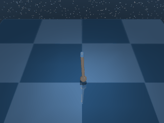

# Pendulum

A single-link pendulum hanging from a fixed pivot.

## PendulumSwingup

{ align=right width=240 }

| Property | Value |
| --- | --- |
| Canonical ID | `mjx/pendulum_swingup-v0` |
| Action space | `Box(-1.0, 1.0, (1,), float32)` |
| Observation space | `Box(-inf, inf, (3,), float32)` |
| Episode length | 1000 |
| Config | `{"ctrl_dt": 0.02, "sim_dt": 0.01, "naconmax": 0, "njmax": 0}` |

### Description

The pendulum starts hanging straight down. The agent applies torque at the pivot to swing it up to and balance it at the upright position. Available torque is small enough that the pendulum can't be lifted in a single push — energy has to build up through several swings before it crosses the top, which is what makes the task interesting despite the simple body.

### Rewards

Uses a dense reward with a `tolerance` indicator over the pole's vertical alignment:

```python
reward = tolerance(pole_vertical, (COSINE_BOUND, 1.0))
```

`pole_vertical` is the z-component of the pole's frame z-axis (i.e. `cos(angle_from_upright)`), and `COSINE_BOUND` marks the lower edge of the upright tolerance band. `tolerance` is DM Control's smooth indicator. It returns:

- `1.0` while `pole_vertical` sits inside `(COSINE_BOUND, 1.0)` (pole near upright).
- A smooth decay below `COSINE_BOUND` as the pole tilts away from vertical.
- `0.0` when the pole points straight down.

### Starting state

```text title=""
obs = [0.2815 0.9596 0.    ]
```

(`cos(angle)`, `sin(angle)`, angular velocity — pole near hanging-down with a small randomisation.)

### Termination

Episode ends when `step >= max_steps` (default 1000). No early termination.

### Usage

```python
import envrax
env = envrax.make("mjx/pendulum_swingup-v0")
```

### Reference

Upstream: [`mujoco_playground/_src/dm_control_suite/pendulum.py`](https://github.com/google-deepmind/mujoco_playground/blob/main/mujoco_playground/_src/dm_control_suite/pendulum.py).
