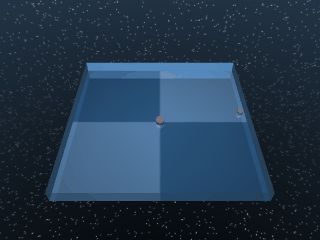

# Point Mass

A simple planar point mass that can be actuated independently in x and y directions.

## PointMass

{ align=right width=240 }

| Property | Value |
| --- | --- |
| Canonical ID | `mjx/point_mass-v0` |
| Action space | `Box(-1.0, 1.0, (2,), float32)` |
| Observation space | `Box(-inf, inf, (4,), float32)` |
| Episode length | 1000 |
| Config | `{"ctrl_dt": 0.02, "sim_dt": 0.02, "naconmax": 0, "njmax": 5}` |

### Description

The point mass moves to a randomised target position in the 2D plane. It's the simplest physics in the suite — no joints, no contacts, no orientation — and is the natural choice for sanity-checking algorithms before throwing them at anything more complex.

### Rewards

Uses a dense reward that multiplies a "near target" tolerance with a small-control penalty:

```python
near_target   = tolerance(
    distance(point_mass, target),
    bounds=(0, target_size),
    margin=target_size,
)
small_control = (4 + tolerance(action, margin=1, sigmoid="quadratic").mean()) / 5
reward = near_target * small_control
```

The two terms each capture a separate concern:

- `near_target` — how close the mass sits to the target, smoothly decaying with distance.
- `small_control` — a soft penalty on action magnitude. The `(4 + ...) / 5` mapping keeps it in `[0.8, 1.0]` so it lightly modulates the primary `near_target` term rather than dominating it.

### Starting state

```text title=""
obs = [-0.2373 -0.0799  0.      0.    ]
```

(point-mass position followed by velocity — mass initialised at a randomised position with zero velocity.)

### Termination

Episode ends when `step >= max_steps` (default 1000). No early termination.

### Usage

```python
import envrax
env = envrax.make("mjx/point_mass-v0")
```

### Reference

Upstream: [`mujoco_playground/_src/dm_control_suite/point_mass.py`](https://github.com/google-deepmind/mujoco_playground/blob/main/mujoco_playground/_src/dm_control_suite/point_mass.py).
