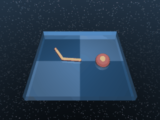
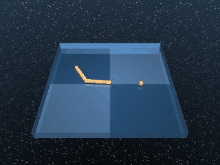

# Reacher

A two-link planar arm reaching toward a randomised target position. Two variants share the body and dynamics; they differ only in the target's size, which controls how hard the sparse reward is to discover.

## ReacherEasy

{ align=right width=240 }

| Property | Value |
| --- | --- |
| Canonical ID | `mjx/reacher_easy-v0` |
| Action space | `Box(-1.0, 1.0, (2,), float32)` |
| Observation space | `Box(-inf, inf, (6,), float32)` |
| Episode length | 1000 |

### Description

The arm's fingertip must reach a randomised target somewhere inside the workspace. The "easy" variant uses a generous target radius (`reacher.BIG_TARGET`), so even a fairly random policy will land inside the target band often enough to bootstrap learning.

### Rewards

Uses a sparse reward built from `tolerance` over fingertip-to-target distance, with `BIG_TARGET` as the upper bound and no margin (so it collapses to a step):

```python
reward = tolerance(
    distance(finger, target),
    bounds=(0, BIG_TARGET),
)
```

With the default zero `margin`, the indicator becomes binary:

- `1.0` when the fingertip is within `BIG_TARGET` of the target.
- `0.0` otherwise.

### Starting state

```text title=""
obs = [-2.5709  1.4054  0.0537  0.1751  0.      0.    ]
```

(joint angles followed by the fingertip-to-target offset and joint velocities — both joints initialised at random angles, target randomised inside the workspace.)

### Termination

Episode ends when `step >= max_steps` (default 1000). No early termination.

### Usage

```python
import envrax
env = envrax.make("mjx/reacher_easy-v0")
```

### Reference

Upstream: [`mujoco_playground/_src/dm_control_suite/reacher.py`](https://github.com/google-deepmind/mujoco_playground/blob/main/mujoco_playground/_src/dm_control_suite/reacher.py).

---

## ReacherHard

{ align=right width=240 }

| Property | Value |
| --- | --- |
| Canonical ID | `mjx/reacher_hard-v0` |
| Action space | `Box(-1.0, 1.0, (2,), float32)` |
| Observation space | `Box(-inf, inf, (6,), float32)` |
| Episode length | 1000 |

### Description

Same arm and dynamics as `ReacherEasy`, but the target shrinks to `reacher.SMALL_TARGET`. The smaller catch radius means random exploration almost never lands inside it — algorithms that can't direct exploration get nowhere on this variant, which makes it a useful stress test for learned exploration bonuses or curiosity-style methods.

### Rewards

Uses a sparse reward built from `tolerance` over fingertip-to-target distance, with the smaller `SMALL_TARGET` upper bound:

```python
reward = tolerance(
    distance(finger, target),
    bounds=(0, SMALL_TARGET),
)
```

With the default zero `margin`, the indicator becomes binary:

- `1.0` when the fingertip is within `SMALL_TARGET` of the target.
- `0.0` otherwise.

### Starting state

```text title=""
obs = [-2.5709  1.4054  0.0537  0.1751  0.      0.    ]
```

### Termination

Episode ends when `step >= max_steps` (default 1000). No early termination.

### Usage

```python
import envrax
env = envrax.make("mjx/reacher_hard-v0")
```

### Reference

Upstream: [`mujoco_playground/_src/dm_control_suite/reacher.py`](https://github.com/google-deepmind/mujoco_playground/blob/main/mujoco_playground/_src/dm_control_suite/reacher.py).
