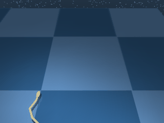

# Swimmer

A multi-link planar swimmer in a viscous fluid. Mujorax ships the canonical six-link variant.

## SwimmerSwimmer6

{ align=right width=240 }

| Property | Value |
| --- | --- |
| Canonical ID | `mjx/swimmer_swimmer6-v0` |
| Action space | `Box(-1.0, 1.0, (5,), float32)` |
| Observation space | `Box(-inf, inf, (25,), float32)` |
| Episode length | 1000 |

### Description

Six articulated links connected by five actuators. The swimmer must move its head toward a randomised target via undulatory motion through the surrounding fluid. Direct propulsion isn't possible — every metre of travel comes from coordinated bending across the body, which is what makes the env an interesting test case despite the simple top-level objective.

### Rewards

Uses a dense reward with a `tolerance` indicator over nose-to-target distance, switched to the `long_tail` sigmoid so the gradient stays gentle at large distances:

```python
reward = tolerance(
    distance(nose, target),
    bounds=(0, target_size),
    margin=5 * target_size,
    sigmoid="long_tail",
)
```

The `long_tail` sigmoid changes how `tolerance` decays. The indicator returns:

- `1.0` once the nose is within `target_size` of the target.
- A long, gentle decay from `1.0` toward zero over the next `5 * target_size` of distance.
- A small but non-zero value well past the margin (the long tail), so distant policies still get a usable gradient.

### Starting state

```text title=""
obs = [ 0.527   0.6077 -0.6753 -0.6334 -0.7211 -1.4088 -0.3333  0.
        0.      0.      0.      0.      0.      0.      0.      0.
        0.      0.      0.      0.      0.      0.      0.      0.
        0.    ]
```

(joint angles followed by joint velocities — body initialised in a slight curl with zero velocity.)

### Termination

Episode ends when `step >= max_steps` (default 1000). No early termination.

### Usage

```python
import envrax
env = envrax.make("mjx/swimmer_swimmer6-v0")
```

### Reference

Upstream: [`mujoco_playground/_src/dm_control_suite/swimmer.py`](https://github.com/google-deepmind/mujoco_playground/blob/main/mujoco_playground/_src/dm_control_suite/swimmer.py).
