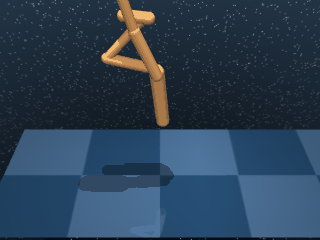

# Walker

A planar bipedal walker. Three variants share the body and dynamics; they differ only in the target locomotion speed baked into the reward — a stationary stand, a walking gait, and a running gait.

## WalkerStand

{ align=right width=240 }

| Property | Value |
| --- | --- |
| Canonical ID | `mjx/walker_stand-v0` |
| Action space | `Box(-1.0, 1.0, (6,), float32)` |
| Observation space | `Box(-inf, inf, (24,), float32)` |
| Episode length | 1000 |
| Config | `{"ctrl_dt": 0.025, "sim_dt": 0.0025, "naconmax": 50_000, "njmax": 100}` |

### Description

The walker has to stand upright and stationary, keeping its torso above a minimum standing height. Without a forward-velocity term, the agent isn't pushed to move — it just has to keep the body tall and aligned vertically.

### Rewards

Uses a dense reward that combines a standing-height tolerance with torso-uprightness, weighted 3:1 in favour of standing height:

```python
standing      = tolerance(
    torso_height,
    bounds=(STAND_HEIGHT, inf),
    margin=STAND_HEIGHT / 2,
)
upright       = (1 + torso_z_up) / 2
reward = (3 * standing + upright) / 4
```

The two terms each capture a separate concern:

- `standing` — the smooth `tolerance` indicator on torso height: `1.0` once the torso clears `STAND_HEIGHT`, decaying smoothly as it sinks toward `STAND_HEIGHT / 2`.
- `upright` — the dot product of the torso's up-axis with world-z, normalised to `[0, 1]`. `1.0` when upright, `0.5` on its side, `0.0` upside-down.

### Starting state

```text title=""
obs = [-0.8415 -0.5403 -0.7934  0.6087 -0.9945  0.1048 -0.9205 -0.3908
       -0.8747 -0.4847  0.911  -0.4125  0.4919 -0.8707 -0.8415  0.
        0.      0.      0.      0.      0.      0.      0.      0.    ]
```

(joint orientations and positions followed by joint velocities — body initialised in a default posture with zero velocity.)

### Termination

Episode ends when `step >= max_steps` (default 1000). No early termination on falling.

### Usage

```python
import envrax
env = envrax.make("mjx/walker_stand-v0")
```

### Reference

Upstream: [`mujoco_playground/_src/dm_control_suite/walker.py`](https://github.com/google-deepmind/mujoco_playground/blob/main/mujoco_playground/_src/dm_control_suite/walker.py).

---

## WalkerWalk

{ align=right width=240 }

| Property | Value |
| --- | --- |
| Canonical ID | `mjx/walker_walk-v0` |
| Action space | `Box(-1.0, 1.0, (6,), float32)` |
| Observation space | `Box(-inf, inf, (24,), float32)` |
| Episode length | 1000 |
| Config | `{"ctrl_dt": 0.025, "sim_dt": 0.0025, "naconmax": 50_000, "njmax": 100}` |

### Description

The same body as `WalkerStand`, now walking forward at a target horizontal speed. The agent has to keep the torso tall and roughly vertical __while__ moving — speed alone isn't enough if the walker collapses, and a stable stand isn't enough if it doesn't make progress.

### Rewards

Uses a dense reward that multiplies `WalkerStand`'s stand reward by a forward-velocity term:

```python
standing      = tolerance(torso_height, bounds=(STAND_HEIGHT, inf), margin=STAND_HEIGHT / 2)
upright       = (1 + torso_z_up) / 2
stand_reward  = (3 * standing + upright) / 4
move_reward   = tolerance(
    horizontal_velocity,
    bounds=(WALK_SPEED, inf),
    margin=WALK_SPEED / 2,
    value_at_margin=0.5,
    sigmoid="linear",
)
reward = stand_reward * (5 * move_reward + 1) / 6
```

Three components combined so neither tall-but-still nor fast-but-fallen is enough:

- `standing` — `tolerance` on torso height: `1.0` once the torso clears `STAND_HEIGHT`, decaying smoothly as it sinks.
- `upright` — torso vertical alignment normalised to `[0, 1]`.
- `move_reward` — linear ramp from `0.5` (at half target speed) to `1.0` (at `WALK_SPEED` or above), then rescaled into `[0.17, 1.0]` via `(5 * move_reward + 1) / 6` so the stand reward stays the dominant factor.

### Starting state

```text title=""
obs = [-0.8415 -0.5403 -0.7934  0.6087 -0.9945  0.1048 -0.9205 -0.3908
       -0.8747 -0.4847  0.911  -0.4125  0.4919 -0.8707 -0.8415  0.
        0.      0.      0.      0.      0.      0.      0.      0.    ]
```

### Termination

Episode ends when `step >= max_steps` (default 1000). No early termination on falling.

### Usage

```python
import envrax
env = envrax.make("mjx/walker_walk-v0")
```

### Reference

Upstream: [`mujoco_playground/_src/dm_control_suite/walker.py`](https://github.com/google-deepmind/mujoco_playground/blob/main/mujoco_playground/_src/dm_control_suite/walker.py).

---

## WalkerRun

{ align=right width=240 }

| Property | Value |
| --- | --- |
| Canonical ID | `mjx/walker_run-v0` |
| Action space | `Box(-1.0, 1.0, (6,), float32)` |
| Observation space | `Box(-inf, inf, (24,), float32)` |
| Episode length | 1000 |
| Config | `{"ctrl_dt": 0.025, "sim_dt": 0.0025, "naconmax": 50_000, "njmax": 100}` |

### Description

The same body as `WalkerStand`, now running forward at a higher target horizontal speed than `WalkerWalk`. The faster cadence forces a more dynamic gait that briefly leaves the ground, which is qualitatively harder than walking despite the identical body — most policies that work for the walking variant don't transfer cleanly to running.

### Rewards

Uses the same dense reward shape as `WalkerWalk`, with `RUN_SPEED` replacing `WALK_SPEED`:

```python
standing      = tolerance(torso_height, bounds=(STAND_HEIGHT, inf), margin=STAND_HEIGHT / 2)
upright       = (1 + torso_z_up) / 2
stand_reward  = (3 * standing + upright) / 4
move_reward   = tolerance(
    horizontal_velocity,
    bounds=(RUN_SPEED, inf),
    margin=RUN_SPEED / 2,
    value_at_margin=0.5,
    sigmoid="linear",
)
reward = stand_reward * (5 * move_reward + 1) / 6
```

Same three components as `WalkerWalk`, just at a higher target speed:

- `standing` — `tolerance` on torso height: `1.0` once the torso clears `STAND_HEIGHT`, decaying smoothly as it sinks.
- `upright` — torso vertical alignment normalised to `[0, 1]`.
- `move_reward` — linear ramp from `0.5` (at half target speed) to `1.0` (at `RUN_SPEED` or above), then rescaled into `[0.17, 1.0]` via `(5 * move_reward + 1) / 6` so the stand reward stays the dominant factor.

### Starting state

```text title=""
obs = [-0.8415 -0.5403 -0.7934  0.6087 -0.9945  0.1048 -0.9205 -0.3908
       -0.8747 -0.4847  0.911  -0.4125  0.4919 -0.8707 -0.8415  0.
        0.      0.      0.      0.      0.      0.      0.      0.    ]
```

### Termination

Episode ends when `step >= max_steps` (default 1000). No early termination on falling.

### Usage

```python
import envrax
env = envrax.make("mjx/walker_run-v0")
```

### Reference

Upstream: [`mujoco_playground/_src/dm_control_suite/walker.py`](https://github.com/google-deepmind/mujoco_playground/blob/main/mujoco_playground/_src/dm_control_suite/walker.py).
