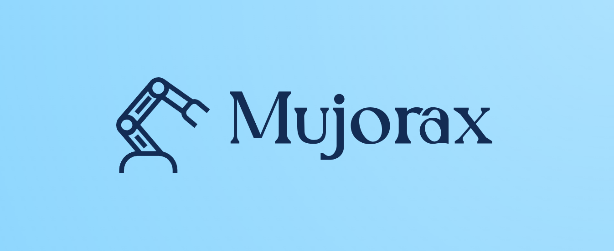

---
hide:
  - navigation
---

*Mujorax, a JAX-native MuJoCo environment suite for Envrax.*

---

    <a href="/" target="_blank" style="text-align: center;">
        <svg xmlns="http://www.w3.org/2000/svg" height="32" width="28" viewBox="0 0 448 512"><path fill="rgba(255, 255, 255, 0.7)" d="M96 0C43 0 0 43 0 96V416c0 53 43 96 96 96H384h32c17.7 0 32-14.3 32-32s-14.3-32-32-32V384c17.7 0 32-14.3 32-32V32c0-17.7-14.3-32-32-32H384 96zm0 384H352v64H96c-17.7 0-32-14.3-32-32s14.3-32 32-32zm32-240c0-8.8 7.2-16 16-16H336c8.8 0 16 7.2 16 16s-7.2 16-16 16H144c-8.8 0-16-7.2-16-16zm16 48H336c8.8 0 16 7.2 16 16s-7.2 16-16 16H144c-8.8 0-16-7.2-16-16s7.2-16 16-16z"/></svg>
        
Docs

    </a>
    <a href="https://github.com/Achronus/mujorax" target="_blank"  style="text-align: center;">
        <svg xmlns="http://www.w3.org/2000/svg" height="32" width="28" viewBox="0 0 640 512"><path fill="rgba(255, 255, 255, 0.7)" d="M392.8 1.2c-17-4.9-34.7 5-39.6 22l-128 448c-4.9 17 5 34.7 22 39.6s34.7-5 39.6-22l128-448c4.9-17-5-34.7-22-39.6zm80.6 120.1c-12.5 12.5-12.5 32.8 0 45.3L562.7 256l-89.4 89.4c-12.5 12.5-12.5 32.8 0 45.3s32.8 12.5 45.3 0l112-112c12.5-12.5 12.5-32.8 0-45.3l-112-112c-12.5-12.5-32.8-12.5-45.3 0zm-306.7 0c-12.5-12.5-32.8-12.5-45.3 0l-112 112c-12.5 12.5-12.5 32.8 0 45.3l112 112c12.5 12.5 32.8 12.5 45.3 0s12.5-32.8 0-45.3L77.3 256l89.4-89.4c12.5-12.5 12.5-32.8 0-45.3z"/></svg>
        
Code

    </a>

---

## Acknowledgements

Mujorax wraps the work of several upstream projects:

- [MuJoCo Playground](https://github.com/google-deepmind/mujoco_playground) (Apache 2.0) — the underlying environment implementations.
- [MuJoCo](https://github.com/google-deepmind/mujoco) and [MJX](https://github.com/google-deepmind/mujoco) (Apache 2.0) — the physics engine and JAX bindings.
- [Envrax](https://github.com/Achronus/envrax) (MIT) — the registry and base environment API.

Locomotion and Manipulation environments auto-download [`mujoco_menagerie`](https://github.com/google-deepmind/mujoco_menagerie) on first load. That repository's robot models ship under per-model licenses, including some with non-commercial-use restrictions; refer to it directly when using affected environments.
